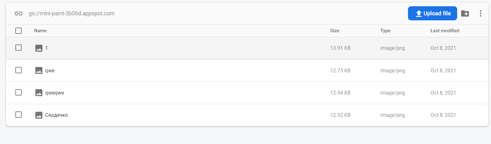
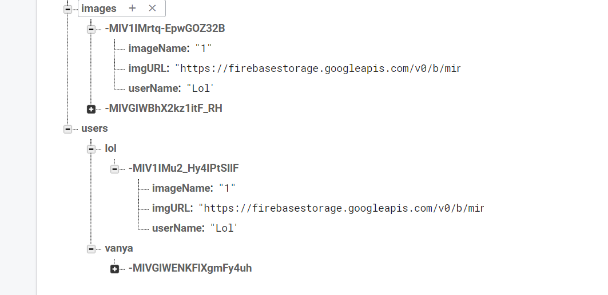

## Task
https://docs.google.com/document/d/1feIA0eu0NkR4J2mCdCc8oPErbET--IlqAEoSpRo1KHA/edit

## How to run the app
npm install
____
npm run

## Database snapshot
#### storage
Здесь хранятся абсолютно все фотографии. И сразу же прокидываются в realtime-database

#### realtime database

Здесь хранится два списка.
###### images
Список ссылок на абсолютно все картинки всех пользователей
###### users
Список пользователей и их картинки 

## Application stack
1) react-redux
2) react-router-dom
3) redux
4) redux-thunk
5) styled-components
6) typescript